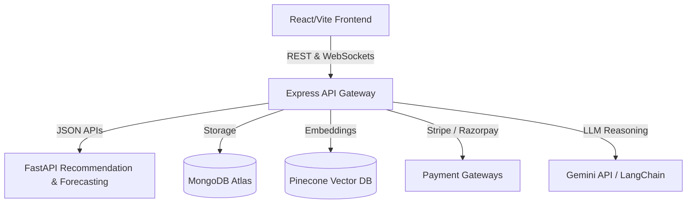

# Synapse AI — AI Agent Marketplace & Automation Ecosystem

Synapse AI is a production-grade SaaS platform enabling creators to build, train, publish, monetize, and automate custom AI agents.

## Architecture Overview



- **Frontend (`/frontend`)**: React, Vite, Tailwind CSS, Redux Toolkit, Framer Motion, and Recharts.
- **Backend (`/backend`)**: Express.js server, Socket.io (real-time chat and multi-agent coordination), Mongoose (database management), and custom Gemini workflows.
- **ML Service (`/ml-service`)**: Python FastAPI server utilizing Scikit-learn to handle recommendations, anomaly detection, churn prediction, and usage analytics.

## Running Locally

1. **Install Dependencies**:
   Initialize and install dependencies for all modules in one go:
   ```bash
   npm run bootstrap
   ```

2. **Configure Environment**:
   Copy the example environment settings and populate your keys:
   ```bash
   cp .env.example .env
   ```

3. **Start All Services**:
   Launch the Node.js API, Python FastAPI service, and Vite dev environment in parallel:
   ```bash
   npm run dev
   ```

*Note: If specific SaaS environment keys (MongoDB, Pinecone, Stripe) are omitted, the code gracefully switches to fully interactive sandbox models in-memory or using local JSON database logs.*
